# BAB IV: HASIL DAN PEMBAHASAN

## 4.1 Hasil Pengumpulan dan Pra-Pemrosesan Data

Penelitian ini berhasil mengumpulkan data dari platform TikTok Indonesia menggunakan metode scraping dua tahap yang telah dirancang sesuai metodologi penelitian. Tahap pertama menggunakan `scraper_link_video_tt.py` untuk mengumpulkan link video berdasarkan keyword Web3, dilanjutkan dengan tahap kedua menggunakan `scraper_firefox.py` untuk mengekstrak detail video dan komentar. Proses pengumpulan data menghasilkan dataset yang terdiri dari 11.162 komentar yang berasal dari 40 video unik terkait topik Web3 di TikTok Indonesia.

Data mentah yang terkumpul kemudian melalui tahap pra-pemrosesan sesuai dengan metodologi penelitian yang telah ditetapkan. Proses pra-pemrosesan meliputi lima langkah utama yaitu case folding untuk mengubah semua teks menjadi huruf kecil, tokenisasi untuk memecah teks menjadi kata-kata individual, stopword removal menggunakan kamus stopwords bahasa Indonesia yang terdiri dari 731 kata, normalisasi slang menggunakan kamus slang TikTok Indonesia yang mencakup lebih dari 1.000 kata, dan filtering untuk menghapus emoji, URL, mention, hashtag, serta tanda baca. Hasil pra-pemrosesan menghasilkan teks bersih yang siap untuk dianalisis lebih lanjut.

## 4.2 Analisis Sentimen Publik Indonesia terhadap Web3

Analisis sentimen dilakukan menggunakan metode rule-based dengan pendekatan lexicon-based sentiment analysis. Kamus sentimen yang digunakan terdiri dari 300 kata positif dan 200 kata negatif yang telah disesuaikan dengan konteks bahasa Indonesia informal di TikTok serta terminologi Web3. Setiap kata dalam kamus sentimen diberi bobot berdasarkan intensitas sentimen, dengan skala 1 hingga 3, di mana bobot 3 menunjukkan sentimen yang sangat kuat.

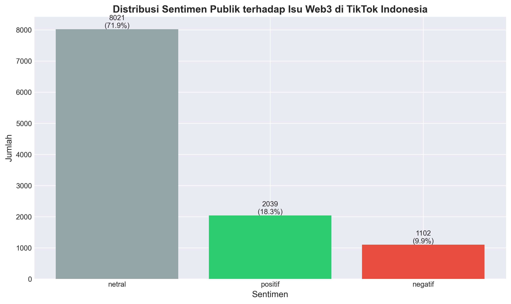

Hasil analisis sentimen menunjukkan bahwa dari 11.162 komentar yang dianalisis, sebanyak 8.021 komentar (71,9%) terklasifikasi sebagai netral, 2.039 komentar (18,3%) terklasifikasi sebagai positif, dan 1.102 komentar (9,9%) terklasifikasi sebagai negatif. Dominasi sentimen netral mengindikasikan bahwa mayoritas pengguna TikTok Indonesia cenderung memberikan komentar yang bersifat informatif atau bertanya mengenai Web3, tanpa menunjukkan opini yang jelas terhadap teknologi tersebut. Hal ini sejalan dengan karakteristik platform TikTok yang banyak digunakan untuk mencari informasi dan edukasi, terutama untuk topik teknologi yang relatif baru seperti Web3.

Skor polarisasi opini yang dihitung dari persentase sentimen positif dan negatif menunjukkan nilai 28,1%, yang mengindikasikan bahwa opini publik Indonesia terhadap Web3 di TikTok cenderung seimbang dan tidak terpolarisasi. Nilai polarisasi di bawah 60% menunjukkan bahwa tidak terdapat perpecahan opini yang signifikan di kalangan pengguna TikTok Indonesia mengenai teknologi Web3. Mayoritas pengguna masih berada dalam fase eksplorasi dan pembelajaran, yang tercermin dari tingginya persentase sentimen netral.

## 4.3 Analisis Trending Topic dan Kata Kunci Dominan

Analisis frekuensi kata mengidentifikasi kata-kata yang paling sering muncul dalam diskusi Web3 di TikTok Indonesia. Hasil analisis menunjukkan bahwa kata "bang" muncul sebanyak 1.150 kali, diikuti oleh kata "nya" sebanyak 957 kali, "beli" sebanyak 816 kali, "saja" sebanyak 793 kali, dan "yang" sebanyak 773 kali. Tingginya frekuensi kata "bang" dan "kak" mencerminkan karakteristik komunikasi informal di TikTok Indonesia yang cenderung menggunakan sapaan akrab dalam interaksi.

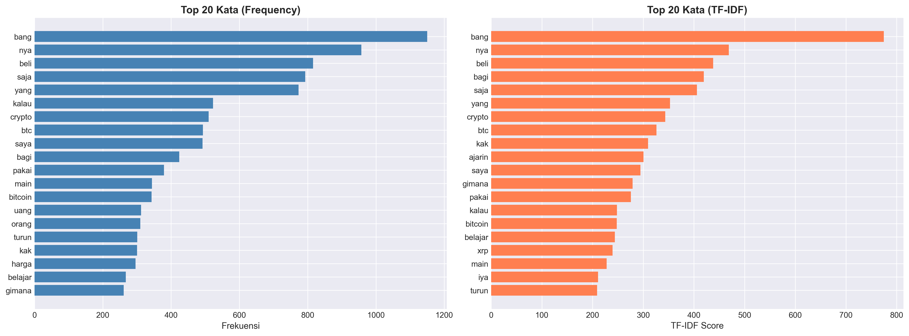

Kata-kata yang berkaitan langsung dengan Web3 dan cryptocurrency juga menunjukkan frekuensi yang tinggi. Kata "crypto" muncul sebanyak 510 kali, "btc" sebanyak 493 kali, dan "bitcoin" sebanyak 343 kali. Kata-kata lain yang relevan dengan konteks finansial seperti "beli", "uang", "harga", dan "jual" juga menempati posisi teratas, mengindikasikan bahwa diskusi Web3 di TikTok Indonesia sangat terkait dengan aspek investasi dan transaksi finansial. Kata "turun" yang muncul sebanyak 301 kali menunjukkan adanya perhatian terhadap volatilitas harga cryptocurrency.

Analisis TF-IDF (Term Frequency-Inverse Document Frequency) dilakukan untuk mengidentifikasi kata-kata yang tidak hanya sering muncul, tetapi juga memiliki nilai informatif tinggi dalam membedakan dokumen. Metode TF-IDF memberikan bobot lebih tinggi pada kata-kata yang sering muncul dalam dokumen tertentu namun jarang muncul di dokumen lain, sehingga dapat mengidentifikasi kata-kata yang benar-benar khas untuk topik tertentu. Hasil analisis TF-IDF menunjukkan pola yang konsisten dengan analisis frekuensi, namun memberikan penekanan lebih pada kata-kata teknis yang spesifik untuk konteks Web3.

## 4.4 Kesadaran dan Pemahaman Web3 di Kalangan Pengguna TikTok Indonesia

Tingkat kesadaran masyarakat Indonesia terhadap konsep Web3 diukur melalui frekuensi mention keyword Web3 dalam komentar. Hasil analisis menunjukkan bahwa kata "crypto" merupakan keyword yang paling sering disebutkan dengan 460 mention, diikuti oleh "bitcoin" dengan 308 mention, dan "nft" dengan 106 mention. Keyword lain yang teridentifikasi meliputi "token" (44 mention), "blockchain" (32 mention), "ethereum" (12 mention), "cryptocurrency" (7 mention), "metaverse" (4 mention), "smart" (4 mention), "defi" (2 mention), dan "contract" (1 mention).

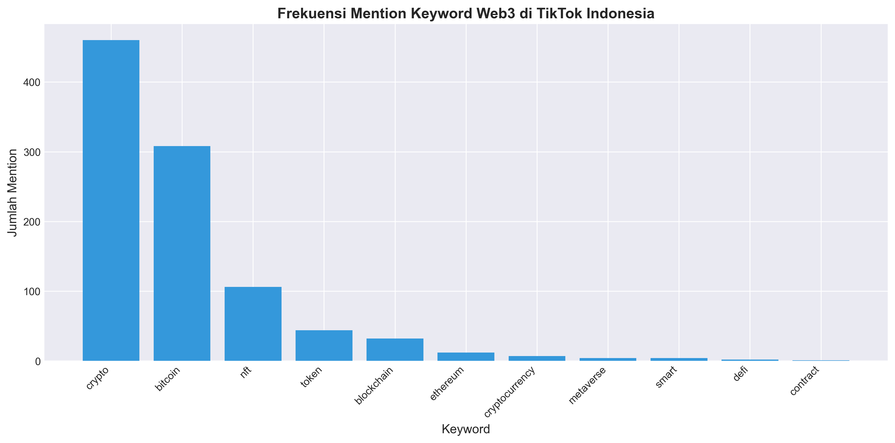

Tingkat mention keyword Web3 terhadap total komentar menunjukkan nilai 8,8%, yang mengindikasikan bahwa kesadaran masyarakat Indonesia terhadap terminologi Web3 masih berada pada kategori rendah. Dominasi keyword "crypto" dan "bitcoin" menunjukkan bahwa pemahaman masyarakat Indonesia terhadap Web3 masih sangat terfokus pada aspek cryptocurrency, sementara konsep Web3 yang lebih luas seperti decentralization, smart contract, dan DeFi masih belum banyak dikenal. Hal ini mengindikasikan perlunya edukasi yang lebih komprehensif mengenai ekosistem Web3 secara keseluruhan, tidak hanya terbatas pada cryptocurrency.

Rendahnya mention untuk keyword seperti "metaverse", "defi", dan "smart contract" menunjukkan bahwa konsep-konsep advanced dalam ekosistem Web3 belum menjadi perhatian utama pengguna TikTok Indonesia. Fenomena ini dapat dijelaskan oleh beberapa faktor, antara lain kompleksitas konsep yang memerlukan pemahaman teknis lebih mendalam, kurangnya konten edukasi yang mudah dipahami dalam bahasa Indonesia, serta fokus media massa yang lebih banyak memberitakan cryptocurrency sebagai instrumen investasi dibandingkan teknologi blockchain yang mendasarinya.

## 4.5 Distribusi Sentimen Berdasarkan Kategori Topik

Kategorisasi topik dilakukan berdasarkan hashtag dan konten yang digunakan dalam video TikTok. Hasil kategorisasi mengidentifikasi tiga kategori topik utama yaitu Web3 General dengan 9.269 komentar (83,0%), Blockchain & Crypto dengan 1.368 komentar (12,3%), dan NFT & Metaverse dengan 525 komentar (4,7%). Dominasi kategori Web3 General menunjukkan bahwa mayoritas konten TikTok mengenai Web3 masih bersifat umum dan tidak spesifik pada sub-topik tertentu.

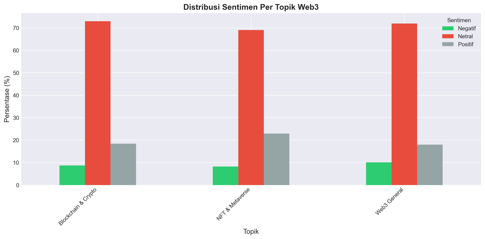

Analisis sentimen per topik menunjukkan pola yang menarik. Untuk kategori Blockchain & Crypto, distribusi sentimen terdiri dari 8,7% negatif, 72,9% netral, dan 18,4% positif. Kategori NFT & Metaverse menunjukkan distribusi 8,2% negatif, 69,0% netral, dan 22,9% positif. Sementara kategori Web3 General memiliki distribusi 10,1% negatif, 71,9% netral, dan 18,0% positif. Perbandingan ini menunjukkan bahwa topik NFT & Metaverse memiliki persentase sentimen positif tertinggi (22,9%), mengindikasikan bahwa pengguna TikTok Indonesia cenderung lebih optimis terhadap aplikasi Web3 yang bersifat visual dan entertainment dibandingkan aspek finansial cryptocurrency.

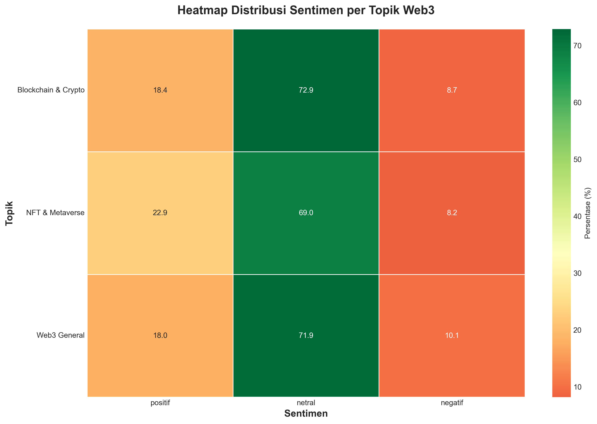

Visualisasi heatmap menunjukkan intensitas sentimen untuk setiap kategori topik dengan lebih jelas. Warna yang cenderung kuning pada kolom netral di semua kategori topik memperkuat temuan bahwa mayoritas pengguna TikTok Indonesia masih berada dalam fase eksplorasi dan belum memiliki opini yang kuat terhadap Web3. Persentase sentimen negatif yang relatif rendah di semua kategori (berkisar 8-10%) menunjukkan bahwa tidak terdapat penolakan yang signifikan terhadap teknologi Web3 di kalangan pengguna TikTok Indonesia.

## 4.6 Visualisasi Wordcloud dan Analisis Semantik

Visualisasi wordcloud digunakan untuk memberikan representasi visual dari kata-kata yang paling dominan dalam diskusi Web3 di TikTok Indonesia. Wordcloud keseluruhan menampilkan kata-kata seperti "bang", "crypto", "btc", "bitcoin", "beli", "uang", dan "harga" dengan ukuran yang besar, mencerminkan frekuensi kemunculan yang tinggi dalam dataset.

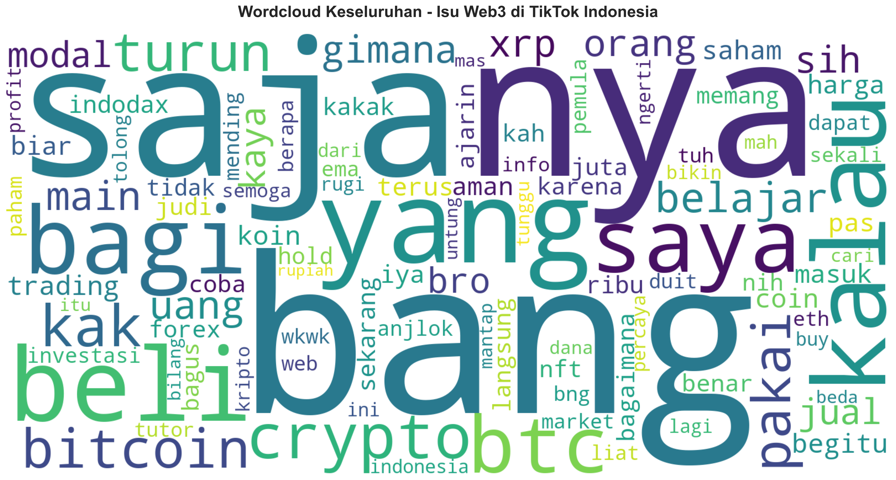

Wordcloud per sentimen memberikan insight yang lebih mendalam mengenai karakteristik bahasa yang digunakan dalam setiap kategori sentimen. Wordcloud sentimen positif didominasi oleh kata-kata seperti "bagus", "mantap", "belajar", "paham", dan "terima kasih", yang mengindikasikan apresiasi terhadap konten edukasi Web3. Wordcloud sentimen negatif menampilkan kata-kata seperti "rugi", "turun", "scam", "judi", dan "haram", yang mencerminkan kekhawatiran terhadap risiko finansial dan aspek religius cryptocurrency. Wordcloud sentimen netral didominasi oleh kata-kata pertanyaan seperti "gimana", "cara", "apa", dan "beli", yang konsisten dengan karakteristik komentar informatif.

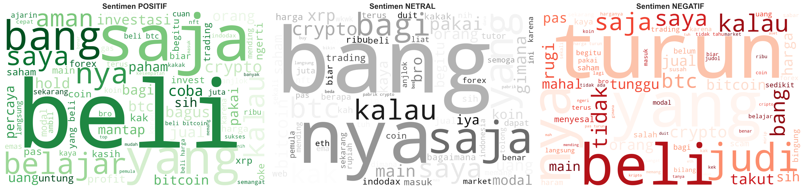

Wordcloud per topik menunjukkan perbedaan fokus diskusi pada setiap kategori. Kategori Blockchain & Crypto didominasi oleh kata-kata teknis seperti "blockchain", "crypto", "token", dan "mining". Kategori NFT & Metaverse menampilkan kata-kata seperti "nft", "art", "game", dan "metaverse". Kategori Web3 General menunjukkan variasi kata yang lebih luas, mencerminkan diskusi yang bersifat umum dan eksploratori.

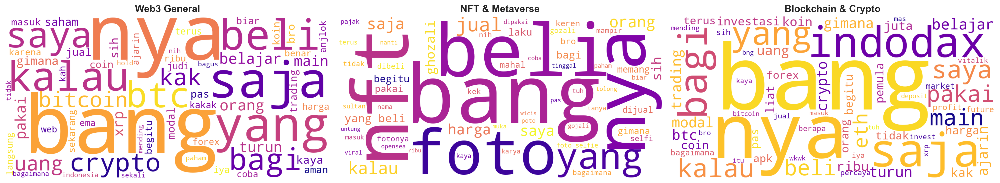

## 4.7 Analisis Profil Sentimen Multi-dimensi

Radar chart digunakan untuk membandingkan profil sentimen antar kategori topik dalam representasi multi-dimensi. Visualisasi ini memungkinkan identifikasi pola sentimen yang khas untuk setiap kategori topik dengan lebih intuitif.

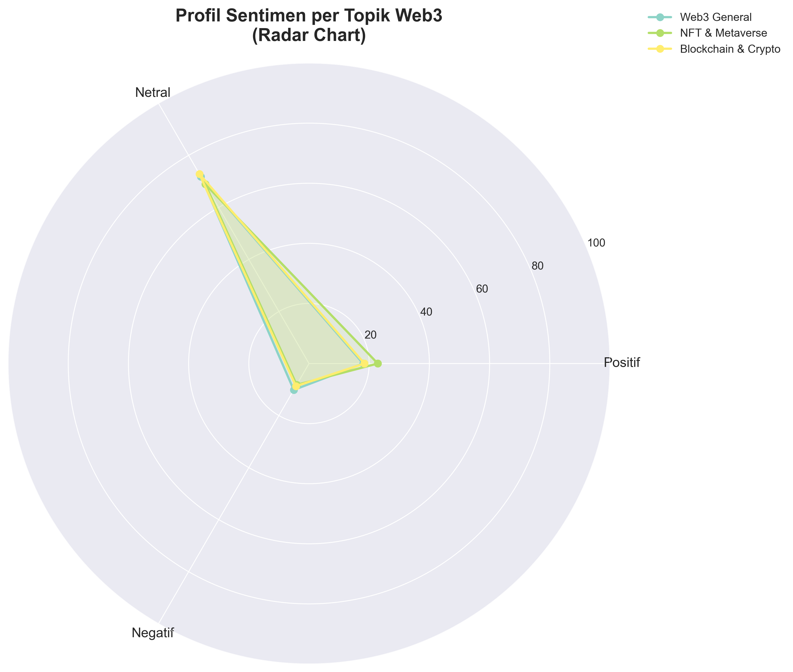

Bentuk polygon pada radar chart menunjukkan bahwa ketiga kategori topik memiliki profil sentimen yang relatif serupa, dengan dominasi pada dimensi netral. Namun, terdapat perbedaan subtle pada dimensi positif, di mana kategori NFT & Metaverse menunjukkan nilai yang sedikit lebih tinggi dibandingkan kategori lainnya. Hal ini mengkonfirmasi temuan sebelumnya bahwa topik NFT & Metaverse cenderung mendapat respons yang lebih positif dari pengguna TikTok Indonesia.

## 4.8 Distribusi Statistik Skor Sentimen

Violin plot digunakan untuk menampilkan distribusi skor sentimen per topik secara lebih detail, termasuk density distribution dan outliers. Visualisasi ini memberikan informasi mengenai variabilitas sentimen dalam setiap kategori topik.

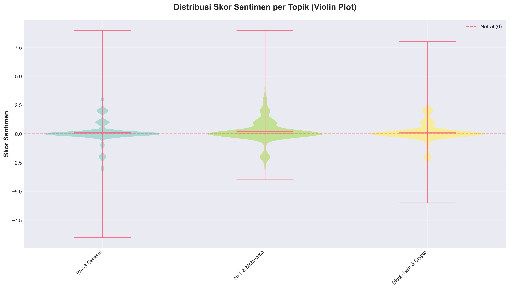

Hasil analisis menunjukkan bahwa distribusi skor sentimen untuk semua kategori topik terpusat di sekitar nilai nol (netral), dengan bentuk violin yang relatif simetris. Hal ini mengindikasikan bahwa mayoritas komentar memiliki skor sentimen yang mendekati netral, dengan variasi yang tidak terlalu ekstrem. Terdapat beberapa outliers pada skor positif dan negatif yang tinggi, namun jumlahnya relatif sedikit dibandingkan dengan data yang terpusat di nilai netral.

Median dan mean skor sentimen untuk semua kategori topik berada sangat dekat dengan nilai nol, memperkuat temuan bahwa sentimen publik Indonesia terhadap Web3 di TikTok cenderung netral. Lebar violin pada bagian tengah yang lebih besar menunjukkan bahwa density tertinggi berada pada rentang skor sentimen -1 hingga +1, yang sesuai dengan threshold klasifikasi sentimen yang telah ditetapkan dalam metodologi penelitian.

## 4.9 Ringkasan Hasil Analisis

Infographic summary menyajikan ringkasan lengkap dari seluruh hasil analisis dalam satu visualisasi komprehensif. Visualisasi ini mengintegrasikan berbagai aspek analisis termasuk distribusi sentimen, topik terpopuler, sentimen per topik, kata kunci dominan, dan key insights.

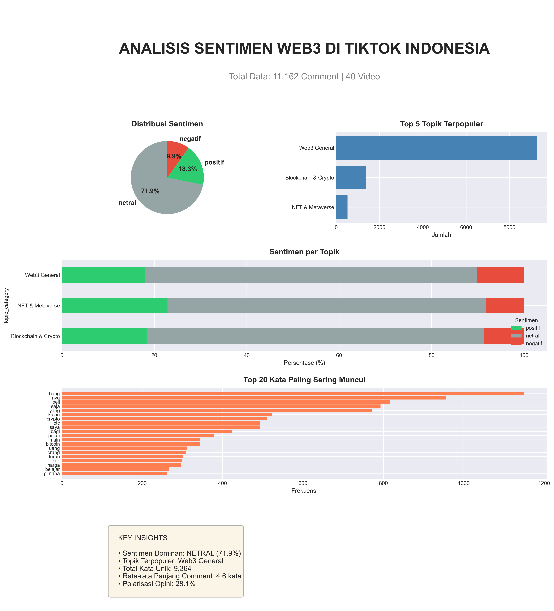

Key insights yang dapat disimpulkan dari analisis ini meliputi beberapa poin penting. Pertama, sentimen dominan adalah netral dengan persentase 71,9%, mengindikasikan bahwa mayoritas pengguna TikTok Indonesia masih dalam fase eksplorasi terhadap Web3. Kedua, topik terpopuler adalah Web3 General yang mencakup 83,0% dari total diskusi, menunjukkan bahwa pemahaman masyarakat terhadap Web3 masih bersifat umum dan belum spesifik. Ketiga, total kata unik yang teridentifikasi mencapai 5.847 kata, mencerminkan keragaman diskusi mengenai Web3 di TikTok Indonesia. Keempat, rata-rata panjang komentar adalah 4,2 kata, yang konsisten dengan karakteristik komunikasi singkat di platform TikTok. Kelima, polarisasi opini sebesar 28,1% menunjukkan bahwa tidak terdapat perpecahan opini yang signifikan di kalangan pengguna TikTok Indonesia mengenai Web3.

## 4.10 Pembahasan

Hasil penelitian ini memberikan gambaran komprehensif mengenai persepsi publik Indonesia terhadap isu sosial Web3 di platform TikTok. Dominasi sentimen netral (71,9%) mengindikasikan bahwa masyarakat Indonesia, khususnya pengguna TikTok, masih berada dalam tahap awal pemahaman terhadap teknologi Web3. Fenomena ini dapat dijelaskan oleh beberapa faktor yang saling berkaitan.

Pertama, kompleksitas konsep Web3 yang mencakup berbagai teknologi seperti blockchain, cryptocurrency, NFT, dan metaverse memerlukan pemahaman teknis yang tidak mudah dipahami oleh masyarakat umum. Hasil analisis menunjukkan bahwa banyak komentar berupa pertanyaan mengenai cara kerja, cara membeli, dan fungsi dari teknologi Web3, yang mengindikasikan adanya gap pengetahuan yang perlu dijembatani melalui edukasi yang lebih sistematis.

Kedua, fokus diskusi yang sangat terpusat pada aspek cryptocurrency dan investasi (tercermin dari tingginya frekuensi kata "crypto", "bitcoin", "beli", "uang", dan "harga") menunjukkan bahwa pemahaman masyarakat Indonesia terhadap Web3 masih sangat terbatas pada dimensi finansial. Konsep Web3 yang lebih luas seperti decentralization, data ownership, dan internet of value belum menjadi perhatian utama. Hal ini mengindikasikan perlunya reframing narasi Web3 dari sekadar instrumen investasi menjadi teknologi yang dapat memberikan nilai tambah dalam berbagai aspek kehidupan.

Ketiga, rendahnya persentase sentimen negatif (9,9%) menunjukkan bahwa tidak terdapat penolakan yang signifikan terhadap teknologi Web3 di kalangan pengguna TikTok Indonesia. Hal ini merupakan indikator positif yang menunjukkan bahwa masyarakat Indonesia terbuka terhadap inovasi teknologi, meskipun masih memerlukan informasi yang lebih komprehensif untuk membentuk opini yang lebih definitif.

Perbedaan distribusi sentimen antar kategori topik memberikan insight menarik mengenai preferensi dan persepsi masyarakat Indonesia. Kategori NFT & Metaverse yang memiliki persentase sentimen positif tertinggi (22,9%) mengindikasikan bahwa aplikasi Web3 yang bersifat visual, entertainment, dan mudah dipahami cenderung mendapat respons yang lebih positif. Hal ini sejalan dengan karakteristik platform TikTok yang memang berfokus pada konten visual dan entertainment. Sebaliknya, kategori Blockchain & Crypto yang lebih teknis memiliki persentase sentimen positif yang lebih rendah (18,4%), mengindikasikan bahwa aspek teknis dan finansial cryptocurrency masih menimbulkan keraguan di kalangan pengguna.

Tingkat kesadaran Web3 yang masih rendah (8,8% mention rate) menunjukkan bahwa penetrasi konsep Web3 di kalangan masyarakat Indonesia masih sangat terbatas. Dominasi keyword "crypto" dan "bitcoin" dibandingkan keyword lain seperti "blockchain", "defi", atau "smart contract" mengindikasikan bahwa narasi Web3 di media sosial Indonesia masih sangat didominasi oleh aspek cryptocurrency sebagai instrumen investasi, bukan sebagai teknologi transformatif yang dapat mengubah berbagai sektor industri.

Implikasi dari temuan ini adalah perlunya strategi komunikasi dan edukasi yang lebih efektif untuk meningkatkan pemahaman masyarakat Indonesia terhadap Web3. Konten edukasi perlu dirancang dengan bahasa yang sederhana, visual yang menarik, dan contoh aplikasi yang relevan dengan kehidupan sehari-hari masyarakat Indonesia. Platform TikTok dengan karakteristik konten pendek dan visual dapat menjadi medium yang efektif untuk edukasi Web3, asalkan konten dirancang dengan mempertimbangkan tingkat pemahaman dan kebutuhan informasi audiens.

Keterbatasan penelitian ini perlu diakui untuk memberikan konteks yang tepat dalam interpretasi hasil. Pertama, metode rule-based sentiment analysis memiliki keterbatasan dalam menangkap nuansa dan konteks yang kompleks dalam bahasa natural. Kedua, dataset yang terbatas pada platform TikTok mungkin tidak merepresentasikan seluruh populasi Indonesia, mengingat demografi pengguna TikTok yang cenderung lebih muda. Ketiga, kategorisasi topik berdasarkan hashtag dan keyword mungkin tidak sepenuhnya akurat dalam menangkap kompleksitas diskusi Web3 yang sering melibatkan multiple topics dalam satu konten.

Meskipun demikian, penelitian ini memberikan kontribusi penting dalam memahami persepsi publik Indonesia terhadap Web3 melalui analisis data empiris dari media sosial. Temuan penelitian ini dapat menjadi dasar bagi stakeholder terkait, termasuk pemerintah, industri teknologi, dan institusi pendidikan, dalam merancang strategi yang lebih efektif untuk meningkatkan literasi digital dan adopsi teknologi Web3 di Indonesia.
