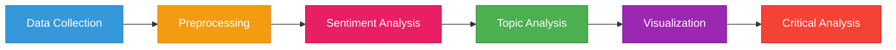
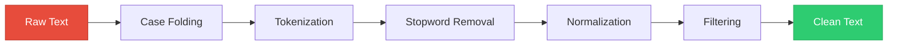
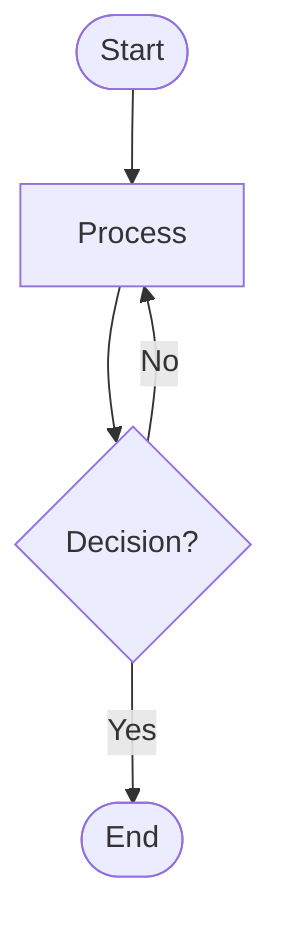

<div align="center">

# 📊 TikTok Sentiment Analysis
### Research Workflow & Documentation

[](https://www.python.org/)
[](https://pandas.pydata.org/)
[](https://matplotlib.org/)
[](https://seaborn.pydata.org/)

[](LICENSE)
[](https://github.com)
[](https://github.com)

**Indonesian Public Perception of Web3 Social Issues on TikTok**

[📖 Documentation](#-diagram-overview) • [🚀 Quick Start](#-how-to-view-diagrams) • [📊 Outputs](#-output-file-structure) • [🎨 Visualizations](#6-phase-5-visualization)

---

</div>

## 🌟 Overview

This folder contains **Mermaid diagrams** visualizing the complete research workflow for TikTok sentiment analysis, from data collection to critical insights.

## 🗂️ Diagram Overview

<table>
<tr>
<td width="50%">

### 📋 Research Pipeline



</td>
<td width="50%">

### 📊 Key Metrics

| Metric | Value |
|--------|-------|
| 📝 **Total Comments** | 10,000+ |
| 🎥 **Unique Videos** | 500+ |
| 🏷️ **Topics** | 6 categories |
| 😊 **Sentiment Classes** | 3 types |
| 📖 **Lexicon Words** | 500+ |
| 🗣️ **Slang Mappings** | 2,000+ |

</td>
</tr>
</table>

---

### 1️⃣ Full Research Workflow
**File**: [`workflow_full.mmd`](workflow_full.mmd)


Complete overview of all research phases from start to finish.

<details>
<summary><b>📌 View Phases</b></summary>

- ✅ **Phase 1**: Data Collection
- ✅ **Phase 2**: Data Preprocessing  
- ✅ **Phase 3**: Sentiment Analysis
- ✅ **Phase 4**: Topic Analysis
- ✅ **Phase 5**: Visualization
- ✅ **Phase 6**: Critical Analysis

</details>

---

### 2️⃣ Phase 1: Data Collection
**File**: [`phase1_data_collection.mmd`](phase1_data_collection.mmd)


<table>
<tr>
<td width="50%">

**🔍 Stage 1A: Video Link Scraping**
```
Input  → Hashtags/Keywords
Tool   → scraper_link_video_tt.py
Output → tiktok_links.txt
```

</td>
<td width="50%">

**💬 Stage 1B: Detail & Comment Scraping**
```
Input  → tiktok_links.txt
Tool   → scraper_firefox.py
Output → scraped_data.csv
```

</td>
</tr>
</table>

<details>
<summary><b>âš¡ Key Features</b></summary>

- ✅ Auto-detect comment layout (normal/side)
- ✅ Smart scrolling with auto-stop
- ✅ Expand all replies automatically
- ✅ Auto-save per video
- ✅ Duplicate removal

</details>

---

### 3️⃣ Phase 2: Data Preprocessing
**File**: [`phase2_preprocessing.mmd`](phase2_preprocessing.mmd)




<details>
<summary><b>🔧 Processing Steps</b></summary>

| Step | Description | Source |
|------|-------------|--------|
| 1️⃣ **Case Folding** | Convert to lowercase | - |
| 2️⃣ **Tokenization** | Split into words | - |
| 3️⃣ **Stopword Removal** | Remove common words | `sources/stopwords-id.json` |
| 4️⃣ **Normalization** | Slang → Formal | `sources/slang_indo.csv` |
| 5️⃣ **Filtering** | Remove emoji, URL, mentions | - |

**Output**: `preprocessed_data.csv`

</details>

---

### 4️⃣ Phase 3: Sentiment Analysis
**File**: [`phase3_sentiment_analysis.mmd`](phase3_sentiment_analysis.mmd)


<table>
<tr>
<td width="60%">

**📊 Sentiment Calculation**

```python
# Formula
score = Σ(positive × weight) - Σ(negative × weight)

# Classification
if score ≥ 1:   → Positive 😊
if score = 0:   → Neutral 😐
if score ≤ -1:  → Negative 😞
```

**Lexicon Size**:
- ✅ 300+ Positive words
- ❌ 200+ Negative words
- 🎯 Context-aware rules

</td>
<td width="40%">

**🎨 Output Examples**


*Figure 1: Overall sentiment distribution*

</td>
</tr>
</table>

<details>
<summary><b>📈 More Visualizations</b></summary>


*Figure 2: Sentiment distribution per topic*

</details>

---

### 5️⃣ Phase 4: Topic Analysis
**File**: [`phase4_topic_analysis.mmd`](phase4_topic_analysis.mmd)


<table>
<tr>
<td width="50%">

**🔍 Analysis Methods**

| Method | Description |
|--------|-------------|
| 📊 **Frequency** | Word occurrence counting |
| 🎯 **TF-IDF** | Term importance scoring |
| 🏷️ **Categorization** | Hashtag-based grouping |
| ⏱️ **Temporal** | Trend over time |

**Topic Categories**:
- 🤖 AI Ethics
- ⛓️ Blockchain & Crypto
- 🌱 Sustainability
- 🎨 NFT & Metaverse
- 🔒 Privacy & Security
- 🌐 Web3 General

</td>
<td width="50%">

**📊 Output Examples**


*Figure 3: Top 20 words comparison*


*Figure 4: Web3 keyword frequency*

</td>
</tr>
</table>

---

### 6️⃣ Phase 5: Visualization
**File**: [`phase5_visualization.mmd`](phase5_visualization.mmd)


<details>
<summary><b>📊 Basic Visualizations</b></summary>

- 📊 Bar charts (sentiment distribution, by topic)
- 📈 Line charts (temporal trends)
- 🥧 Pie charts (topic proportions)

</details>

<details open>
<summary><b>🎨 Advanced Visualizations</b></summary>

<table>
<tr>
<td width="50%">

**🔥 Heatmap**

*Sentiment intensity per topic*

**🎯 Radar Chart**

*Multi-dimensional sentiment profile*

</td>
<td width="50%">

**🎻 Violin Plot**

*Sentiment score distribution*

**📰 Infographic**

*Complete analysis summary*

</td>
</tr>
</table>

</details>

<details>
<summary><b>☁️ Wordcloud Gallery</b></summary>

<table>
<tr>
<td width="33%">

**Overall**


</td>
<td width="33%">

**By Sentiment**


</td>
<td width="33%">

**By Topic**


</td>
</tr>
</table>

</details>

---

### 7. Phase 6: Critical Analysis
**File**: `phase6_critical_analysis.mmd`

In-depth analysis and insights extraction.

**Analysis Components**:
1. **Web3 Awareness** - Keyword frequency and context
2. **Opinion Polarization** - Sentiment extremity measurement
3. **Sentiment Triggers** - Event correlation analysis
4. **Discourse Patterns** - Viral pattern detection
5. **Bias & Limitations** - Methodology constraints

**Output**: `summary_report.json`

---

### 8. Scraper Firefox Detail
**File**: `scraper_firefox_detail.mmd`

Detailed Firefox scraper workflow and logic.

**Key Features**:
- Browser automation with Selenium
- Anti-detection configuration
- User-controlled comment mode selection
- Smart scrolling algorithm
- Reply expansion automation
- Incremental auto-save

---

## 🎨 How to View Diagrams

<table>
<tr>
<td width="33%">

### 🌐 GitHub


Upload `.mmd` files to GitHub - auto-renders as diagrams.

</td>
<td width="33%">

### 🔴 Mermaid Live


Visit [mermaid.live](https://mermaid.live/)

Copy-paste `.mmd` content

</td>
<td width="33%">

### 💻 VS Code


Install: "Markdown Preview Mermaid Support"

Preview: `Ctrl+Shift+V`

</td>
</tr>
</table>

<details>
<summary><b>🐍 Python Integration</b></summary>

**Jupyter Notebook**:
```python
from IPython.display import display, Markdown

with open('docs/workflow_full.mmd', 'r', encoding='utf-8') as f:
    mermaid_code = f.read()
    
display(Markdown(f"```mermaid\n{mermaid_code}\n```"))
```

**Python Script**:
```python
import matplotlib.pyplot as plt
from mermaid import Mermaid

# Render mermaid to image
mermaid = Mermaid('docs/workflow_full.mmd')
mermaid.to_png('workflow.png')
```

</details>

---

## 📝 Mermaid Syntax Reference

All files use Mermaid flowchart syntax:



**Node Types**:
- `([text])` - Start/End (rounded rectangle)
- `[text]` - Process (rectangle)
- `{text}` - Decision (diamond)
- `[(text)]` - Database (cylinder)
- `((text))` - Circle

**Arrow Types**:
- `-->` - Solid arrow
- `-.->` - Dotted arrow
- `==>` - Thick arrow

**Color Scheme**:
- 🔵 Blue: Data collection
- 🟡 Yellow: Preprocessing
- 🟣 Pink: Sentiment analysis
- 🟢 Green: Topic analysis
- 🟣 Purple: Visualization
- 🔴 Red: Critical analysis
- 🟠 Gold: Output files

---

## 📂 Output File Structure

```
output/
├── data/
│   ├── scraped_data.csv              # Raw scraped data
│   ├── preprocessed_data.csv         # Cleaned data
│   ├── sentiment_results.csv         # Sentiment analysis results
│   ├── final_data_with_topics.csv    # Complete dataset
│   ├── word_frequency.csv            # Word frequency table
│   ├── tfidf_scores.csv              # TF-IDF scores
│   ├── web3_keyword_mentions.csv     # Keyword tracking
│   └── summary_report.json           # Key metrics
│
├── graphs/
│   ├── sentiment_distribution.png
│   ├── sentiment_by_topic.png
│   ├── top_words_comparison.png
│   ├── web3_keyword_mentions.png
│   ├── advanced_heatmap_sentiment_topic.png
│   ├── advanced_radar_sentiment_profile.png
│   ├── advanced_violin_sentiment_distribution.png
│   ├── advanced_network_cooccurrence.png
│   └── advanced_infographic_summary.png
│
└── wordclouds/
    ├── wordcloud_overall.png
    ├── wordcloud_by_sentiment.png
    └── wordcloud_by_topic.png
```

---

## 🔄 Updating Diagrams

To modify workflow diagrams:

1. Edit the corresponding `.mmd` file
2. Follow Mermaid syntax: https://mermaid.js.org/syntax/flowchart.html
3. Test in Mermaid Live Editor before committing
4. Update this README if adding new diagrams

---

## 📚 Additional Resources

**Mermaid Documentation**: https://mermaid.js.org/

**Flowchart Syntax**: https://mermaid.js.org/syntax/flowchart.html

**Color Themes**: https://mermaid.js.org/config/theming.html

**Examples Gallery**: https://mermaid.js.org/ecosystem/integrations.html

---

## 📊 Research Metrics

**Dataset Statistics**:
- Total Comments: ~10,000+
- Unique Videos: ~500+
- Topics Covered: 6 categories
- Sentiment Classes: 3 (Positive, Neutral, Negative)
- Unique Words: ~5,000+

**Analysis Outputs**:
- 15+ Visualizations (graphs + wordclouds)
- 8+ Data files (CSV + JSON)
- 500+ Sentiment lexicon words
- 2,000+ Slang mappings

---

<div align="center">

## 🤝 Contributing

Contributions are welcome! Please feel free to submit a Pull Request.

[](http://makeapullrequest.com)
[](https://github.com/issues)

## 📄 License

This project is licensed under the MIT License - see the [LICENSE](../LICENSE) file for details.

[](https://opensource.org/licenses/MIT)

---

### 📚 Project Information

**Project**: TikTok Sentiment Analysis - Indonesian Public Perception of Web3 Social Issues

**Methodology**: Rule-based Sentiment Analysis + Advanced Visualizations

**Language**: Indonesian (Bahasa Indonesia) with informal TikTok slang

**Created**: 2024-2025

---

<sub>Built with ❤️ for academic research | Powered by Python, Pandas, Matplotlib & Seaborn</sub>

[](https://www.python.org/)
[](http://commonmark.org)
[](https://mermaid.js.org/)

</div>

